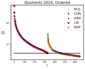
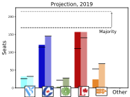

# PMM

This repository contains all the latex files, and software necessary for the parsimonious mixed-member (PMM) calculation as presented in the following work: https://osf.io/preprints/socarxiv/67jne/

As of November 2019, the code has been re-written in Python (formerly c++) for accessibility. 

As of April 2020, the official results of the 2019 election from Elections Canada have been incorporated into the repository, and the corresponding projections added to the document.

<table><tr>
<td> 
<td> 
</tr></table>

Note that "proportionality here is based on each major party's share of all ballots, not just those among major parties. Assignment of seats will generally terminate near quotient values corresponding to the last constituent seat, but not precisely, due to spoiled, and minor-party ballots.

Ultimately, termination criteria is set so that no major party (a major party is, by definition, any party obtaining greater than 5% of the popular vote) is underrepresented by a full seat or more. 
Thus, at each iteration, we take the number of seats in the current parliament that would correspond to a party's proportional share, less the number of seats they currently have. Iff this number is greater than or equal to 1, then their seat count, and the total parliament is incremented by 1.
When no party can satisfy this criteria, the process is complete. 

