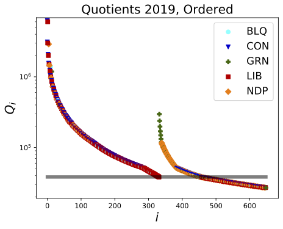
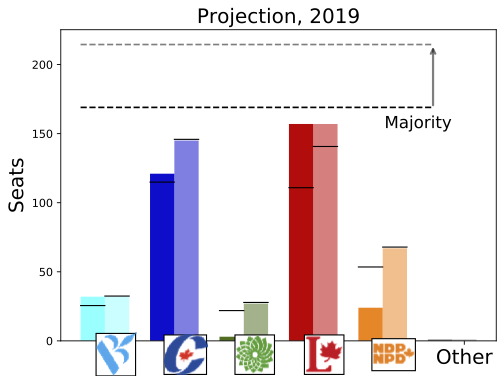

# PMM

This repository contains all the latex files, and software necessary for the parsimonious mixed-member (PMM) calculation as presented in the following work: https://osf.io/preprints/socarxiv/67jne/

As of November 2019, the code has been re-written in Python (formerly c++) for accessibility. As of April 2020, the official results of the 2019 election from Elections Canada have been incorporated into the repository, and the corresponding projections added to the document, examples of which are provided below.

<table><tr>
<td> 
<td> 
</tr></table>

Details and rationale behind this calculation are provided in the above document.
The only input required for this software are 3 data tables from the [results provided directly from Elections Canada](https://www.elections.ca/content.aspx?section=res&dir=rep/off&document=index&lang=e), specifically: summary tables 3, 7, and 8.

In principle, this software should be able to produce such output for any arbitrary election in Canadian history. In practice, it has only been tested on the most recent 3 for the following reason: over time, conventions have changed somewhat in these tables (e.g. division of party seats by gender, party names, language encodings for special characters, etc). Such complications limit this code from accepting input from elections data going back arbitrarily far in history (as of May 2020).
Generalizing this work to accept elections data from arbitrary time points in history remains a work in progress.
